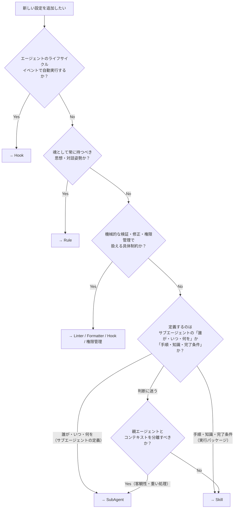

# Cursor 設定の棲み分けガイドライン

Rule・Skill・SubAgent・Hook の使い分け基準を定義する。
新しい設定を作成・編集する際は本ガイドラインに従うこと。

## ⚖️ 設計原則

- **Rule を最小化する**: Rule に書くのは、あらゆる会話で例外なく適用したい普遍的な思想・メインエージェントのコミュニケーションスタイル・最小限の発動条件だけ
- **具体制約はハーネスへ委ねる**: 操作手順、検証条件、権限、フォーマット、チェックリストは Rule ではなく、Skill / SubAgent / Hook / Linter / Formatter / 権限管理 / 人間レビューへ置く
- **Rule は薄く、具体は Skill へ**: Rule の本文は「発動条件 + Skill パス」のスタブに留め、具体的な手順・フォーマット・チェックリストは Skill に持たせる
    - alwaysApply のトークン消費を最小化しつつ、Skill パスの明示で空振りを防ぐ
- **空見出しは削除せず内容を充実させる**: テンプレート上の必須観点を可視化するため、空見出しが見つかった場合は削除ではなく、定義の意図が伝わる内容を追記する
    - ただし、Rule に詳細手順を足すなど各定義の責務を超える内容は書かず、適切な Skill や SubAgent へ移す
- **ユーザーレベル常時適用ルールは Cursor Settings へ**: `~/.cursor/rules/` 配下の `alwaysApply: true` は Cursor 仕様上機能しない
    - 常時適用が必要な内容は `_cursor_user/settings-source/core-rules.md` で版管理し、Cursor Settings → User Rules に手動コピペで反映する
    - `core-rules.md` はエージェントの魂に相当する思想・対話姿勢のみに限定し、環境依存の具体制約は置かない
    - `_cursor_user/rules/` 配下の個別 `.mdc` Rule は description / globs モードのみで運用する
- **手順は Skill に集約する**: 実行手順・前提知識・アウトプット・完了条件は Skill で定義する
- **SubAgent はサブエージェントの Who を定義する**: 独立コンテキストで動くサブエージェントの「誰が・いつ・何を・何をしない」を宣言し、手順の詳細は Skill に委譲する。メインエージェントの Who（コミュニケーションスタイル等）は Rule で定義する
- **Hook はイベント駆動に限定する**: エージェントのライフサイクルイベントに紐づく自動処理のみ
- **Command は使用しない**: Command（`.cursor/commands/`）は Skill で代替する。再利用可能なワークフローを定義する場合は Skill として作成すること

## 📦 4種の定義

### Rule — 普遍的思想と最小制約

全セッションで例外なく適用したい思想・対話姿勢・最小限の制約。

| 項目 | 内容 |
| ---- | ---- |
| 起動 | 設定に基づき自動（alwaysApply / glob / agent-decides） |
| 答える問い | 「常にどう在るか / いつ何を起動するか」 |
| コンテキスト | 親エージェントと共有 |
| ファイル形式 | `.mdc`（YAML frontmatter + Markdown） |
| 配置場所 | `_cursor/rules/`（プロジェクト）、`_cursor_user/rules/`（ユーザー） |

含めるべき内容:
- メインエージェントの Who — コミュニケーションスタイル・対話姿勢など、全会話で例外なく適用すべき思想
- Skill・SubAgent・Hook を正しく機能させるための最小限の発動条件
- プロジェクトを壊し得るため常時または glob 限定で必要な最小制約

含めるべきでない内容:
- 手順・ワークフロー → Skill
- サブエージェントのペルソナ定義 → SubAgent
- イベント駆動の自動処理 → Hook
- 機械的に検出・修正できる制約 → Linter / Formatter / Hook
- コマンド権限や環境依存の実行制御 → 権限管理 / Hook / 実行ハーネス

### Skill — 手順・ワークフローの実行パッケージ

特定タスクの実行に必要な「What & How」をすべて含むパッケージ。
Cursor の Command（`.cursor/commands/`）が担っていた再利用可能なワークフローも Skill で定義する。

| 項目 | 内容 |
| ---- | ---- |
| 起動 | エージェント判断 or ユーザー手動（`/skill-name`） |
| 答える問い | 「何をどうやるか」 |
| コンテキスト | 親エージェントと共有 |
| ファイル形式 | `SKILL.md`（サブディレクトリに補助ファイル可） |
| 配置場所 | `_cursor/skills/*/`（プロジェクト）、`_cursor_user/skills/*/`（ユーザー） |

含めるべき内容:
- ワークフローの手順（ステップバイステップ）
- 手順を実行するための前提知識・参照情報
- 期待するアウトプットの定義
- 完了条件

含めるべきでない内容:
- サブエージェントのペルソナ・行動原則 → SubAgent
- 全セッション適用の制約 → Rule
- イベント駆動の自動処理 → Hook

### SubAgent — サブエージェントの定義書

独立コンテキストで動く**サブエージェント**の「Who」を定義する。メインエージェントの Who は Rule（常時適用）で定義するため、SubAgent にはメインエージェントの振る舞いを書かない。

| 項目 | 内容 |
| ---- | ---- |
| 起動 | Skill 内から Task ツールで明示的に呼び出し |
| 答える問い | 「誰が何を担当するか」 |
| コンテキスト | 親エージェントから分離 |
| ファイル形式 | `.md`（YAML frontmatter + Markdown） |
| 配置場所 | `_cursor/agents/`（プロジェクト）、`_cursor_user/agents/`（ユーザー） |

含めるべき内容:
- 誰か（ペルソナ・専門性）
- いつ呼ぶか（起動条件・トリガー）
- 何を担当するか（責務スコープ）
- 何をしてはいけないか（制約・禁止事項）
- 最小限の行動原則

含めるべきでない内容:
- 詳細な手順・ワークフロー → Skill に委譲
- 前提知識の詳細 → Skill に含める
- 全セッション適用の制約 → Rule

Skill との関係: SubAgent は Skill を参照・実行する。手順の詳細は Skill に委譲し、SubAgent は「何の Skill をどの順で使うか」を知っている。

### Hook — イベント駆動の自動化

エージェントのライフサイクルイベントに紐づく自動処理。

| 項目 | 内容 |
| ---- | ---- |
| 起動 | イベント発火時に自動（sessionStart, afterFileEdit 等） |
| 答える問い | 「いつ何を自動実行するか」 |
| コンテキスト | モデルコンテキスト外（トークン消費なし） |
| ファイル形式 | `hooks.json` + スクリプト |
| 配置場所 | `.cursor/hooks.json` |

含めるべき内容:
- ファイル編集後のフォーマット・検証
- コマンド実行前のセキュリティチェック
- セッション開始・終了時の自動処理

含めるべきでない内容:
- 対話的なワークフロー → Skill
- エージェント定義 → SubAgent
- 常時適用の制約 → Rule

## 🚫 Command を使用しない理由

Cursor の Command（`.cursor/commands/*.md`）は `/コマンド名` で起動する再利用可能プロンプトだが、Skill でも `/skill-name` による手動起動が可能であり、さらに以下の利点がある:

- エージェントが関連性に基づいて自動起動できる
- サブディレクトリに補助ファイル（スクリプト、参照資料）を含められる
- SubAgent との連携パターンが使える

Command で実現できることは Skill ですべて代替できるため、Command は作成せず Skill で対応する。

## 🔀 判断フロー

新しい設定を追加するとき、以下の順で判定する:



### 簡易チェックリスト

1. **イベントに紐づく自動処理か？** → Yes: **Hook**
2. **全セッション・全タスクで、魂として持つべき思想・対話姿勢か？** → Yes: **Rule**
3. **具体的な手順・検証・権限・フォーマット制約か？** → Yes: **Skill / Hook / Linter / Formatter / 権限管理**
4. **独立コンテキストで動くサブエージェントの人格・責務・制約を定義するか？** → Yes: **SubAgent**
5. **上記いずれでもない** → **Skill**

## 🔍 境界ケースの判断例

### 「コミュニケーションスタイル」 → Rule

メインエージェントの Who に該当する。全セッションで例外なく適用すべき制約であり Rule が適切。SubAgent はサブエージェントの Who を定義する場所であり、メインエージェントの振る舞いを置く場所ではない。

### 「エージェントの魂としての core-rules」 → Rule

常に適用したい思想、考え方、対話姿勢は `_cursor_user/settings-source/core-rules.md` に置く。具体的な環境制約、検証手順、同期手順、コマンド実行条件は置かず、Skill / SubAgent / Hook / Linter / Formatter / 権限管理に委ねる。

### 「キーワード検出 → Skill 誘導」（例: auto-detect-voice-input） → Rule + Skill

キーワードの常時監視・Skill への誘導は Rule。実際の処理手順は Skill。検出部分は全会話で動く必要がある。

### 「セッション振り返り」 → Skill + SubAgent

手順・ワークフロー・完了条件は Skill（mt-review-session）。レビュアーのペルソナ・責務は SubAgent（mt-review-session-reviewer）。Skill → SubAgent の連携パターン。

### 「MCP ツールルーティング」 → Rule または Skill

URL を受け取ったときの MCP 優先は、常時適用したい思想として短く置くなら Rule。サービス別の具体手順や失敗時の分岐は Skill に置く。

### 「コミット前のフォーマッタ実行」 → Hook

ファイル編集後の自動フォーマットはイベント駆動。ユーザーの明示的起動を必要としない。

### 「SDD の仕様策定手順」 → Skill

手順・前提知識・アウトプット・完了条件を定義。親エージェントが対話的に実行するためコンテキスト分離不要。

### 「コードレビュアー」 → SubAgent + Skill

レビュアーのペルソナ・責務は SubAgent。チェックリスト・手順は Skill。客観性のためにコンテキスト分離が必要。

## 🔗 4種の関係性

```text
Rule（最小限の制約）
  └─ 全 Skill・SubAgent・Hook に暗黙適用

SubAgent（サブエージェントの誰が・いつ・何を・何をしない）
  └─ Skill を参照・実行（What & How を委譲）

Skill（手順・知識・アウトプット・完了条件）
  └─ SubAgent から呼ばれる or 直接起動

Hook（イベント駆動の自動化）
  └─ エージェントのライフサイクルに紐づく
```
