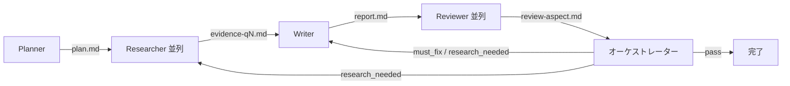

# 調査計画書: [調査テーマ]

## 背景・目的

[2〜3 文で、この調査が必要になった背景と目的を記述する。]

## 前提知識

[2〜3 文で、調査開始時点で既知の前提知識を記述する。]

## 制約・スコープ

- **調査対象**: [対象とする範囲を限定する]
- **調査対象外**: [対象外とする範囲を明示する]
- **時間制約**: [もしあれば]
- **情報源の制約**: [社内/公開、言語、リリース時期など]

## 主要な問い

1. [問い 1]
2. [問い 2]
3. [問い 3]
4. [問い 4] (任意)
5. [問い 5] (任意)

各問いは独立して Researcher に委譲できる粒度にする。3〜7 個を目安とし、5 個までを推奨する。

## 検索戦略

- **主要キーワード**: [検索に使用するキーワード]
- **重視する情報源の種別**: [公式リファレンス / 一次情報 / 信頼できるブログ / など]
- **優先するドメイン**: [公式ドキュメント、論文、信頼できるキュレーションサイトなど]
- **取得しないもの**: [SNS、未検証のフォーラム、極端に古い記事など]

## 期待されるレポート構成

- 前提とスコープ
- 作成日
- 要約
- 詳細な調査結果（番号引用付き）
- 情報源の一覧
- 調査対象の関係性（視覚化）

## 調査終了の判定基準

- 主要な問いのそれぞれが、十分な証拠（≥3 ソース）で回答できている
- 情報源は一次情報または公式リファレンスを優先している
- 推測補完は明示されている
- 目的から外れそうな問いはチェックポイントで確認済み

## 調査の流れ（視覚化）

