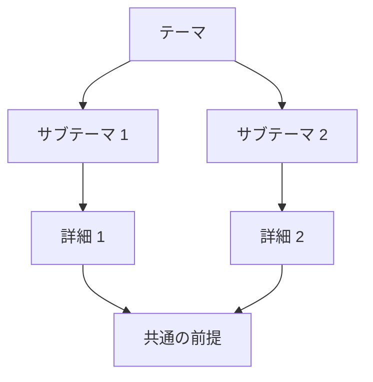

# [調査テーマ]

## 前提とスコープ

- **背景・目的**: [2〜3 文]
- **前提知識**: [2〜3 文]
- **制約・スコープ**: [2〜3 文]

## 作成日

YYYY-MM-DD

## 要約

[調査結果の要約。主要な問いへの回答を 3〜5 文で。]

## 詳細な調査結果

### [問い 1]

- [事実の直後に [1] のような番号引用を付けて記述]
- [事実の直後に [1] のような番号引用を付けて記述]

### [問い 2]

- [事実の直後に [2] のような番号引用を付けて記述]
- [事実の直後に [3] のような番号引用を付けて記述]

### [問い 3]

- ...

## 情報源の一覧

| 番号 | タイトル | URL | 種類 | アクセス日 |
| --- | --- | --- | --- | --- |
| 1 | [タイトル] | [URL] | [公式リファレンス / チュートリアル / ブログ / フォーラム / ニュース / 論文 / GitHub / その他] | YYYY-MM-DD |
| 2 | ... | ... | ... | ... |

## 調査対象の関係性（視覚化）

