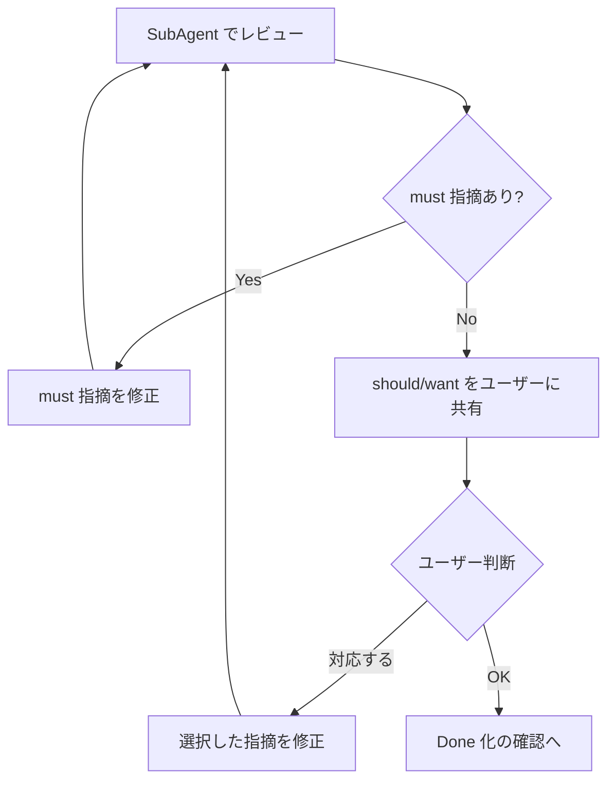

# mt-run-plan

Cursor Plan モードに依存せず、対象プロジェクトの `tmp/plan/` 配下にある計画ファイルを実行するスキルです。
計画の新規作成・リファインメントは扱わず、方針に基づく実行、メモ・履歴更新、完了処理に責務を限定します。

## 🚦 Plan First ルール

この Skill は、承認済み計画の実行だけを扱う。
ファイル編集・状態遷移・外部副作用のあるコマンドを実行する前に、以下を確認する。

1. 実行対象の計画が `refined` または `in-progress` として存在する
2. ユーザーがその計画の実行を明示している
3. これから行う作業が承認済み計画の範囲内である

どれかを満たせない場合は実行せず、`mt-create-plan` で計画作成・修正・再承認へ戻す。
「改善案 N で良い」「この方針で良い」だけでは実行承認とみなさない。

## 🧠 前提知識

- 計画保存先: 対象プロジェクトの `tmp/plan/[status]/`
- 実行対象ステータス: `refined`, `in-progress`
- 完了ステータス: `done`
- Skill 配置ルート:
  今読み込んでいる `mt-run-plan/SKILL.md` の親ディレクトリを基準にする。
  同階層の `mt-plan/` を共有資材の場所として扱う。
- 計画フォーマット: 同階層の `mt-plan/plan-format.md`
- 計画一覧: 同階層の `mt-plan/list-plans.ts`
- 状態遷移: 同階層の `mt-plan/transition-plan.ts`
  （usage と許可遷移は共有資材を Source of Truth とする）
- 関連 Skill: `mt-create-plan`（計画作成・リファインメント）,
  `mt-plan`（作成から実行までの統合入口。未作成なら参照しない）

## 🗣️ 対話選択の提示方法

この Skill で選択肢を提示する場合は、本文内で番号付きリストやコードブロックとして示し、必要に応じて推奨度・理由を添える。
ユーザーには番号か自然文での回答を促し、テキスト回答から選択を解釈する。
サブエージェントとして動作している場合も同じ方法を使う。

## 🏃 ステップ

あなたは計画実行のパートナーとして振る舞ってください。
ユーザーの入力に対して、以下の処理を行ってください。

### 1. 共有資材の確認

今読み込んでいる `mt-run-plan/SKILL.md` の置き場所を基準に、
同階層の `mt-plan/plan-format.md` と `mt-plan/README.md`、
`mt-plan/list-plans.ts`、`mt-plan/transition-plan.ts` があるか確認する。
README かスクリプト先頭の usage を読み、
計画一覧と状態遷移の引数を把握する。

**存在する場合:** ステップ 2 へ進む。

**存在しない場合:** 共有資材タスクが未完了であることを報告し、本 Skill を中断する。
状態遷移が必要な場面で `mv` を直接実行してはいけない。

### 2. 対象計画の特定

ユーザーの入力から実行対象の計画を特定する。

**計画ファイルが直接指定されている場合:**

1. 指定パスを Read ツールで読み込む
2. パスが `tmp/plan/refined/` または `tmp/plan/in-progress/` 配下か確認する
3. `tmp/plan/draft/` 配下なら、先に `mt-create-plan` へ回す案内のうえ中断する
4. `tmp/plan/done/` 配下なら、完了済みであることを伝え、再開するか確認する

**計画名や目的が指定されている場合:**

1. `list-plans.ts` で `tmp/plan/refined/` と `tmp/plan/in-progress/` の候補を列挙する
2. 一致候補が 1 件なら、その計画を対象にする
3. 複数候補なら番号付き選択肢として提示し、ユーザーに選ばせる
4. 候補がなければ、実行可能な計画がないと報告し、必要なら `mt-create-plan` を案内する

**入力がない場合:**

`list-plans.ts` で `tmp/plan/refined/` と `tmp/plan/in-progress/` の計画を一覧し、
番号付き選択肢として提示してユーザーに選ばせる。
候補一覧はコードブロックで提示する。

```text
1. [refined] 20260425-example-plan.md
2. [in-progress] 20260424-active-plan.md
```

`tmp/plan/` は `.gitignore` で ignore 対象になり得るため、候補探索では `Glob` / `rg` の 0 件結果だけで「存在しない」と判断しない。
0 件時も `list-plans.ts` の確認結果をもとに、確認したステータスとディレクトリを報告する。

### 3. 実行準備

対象計画のステータスに応じて準備する。
準備前に、対象計画が承認済みであり、ユーザーが実行を明示していることを確認する。

**`refined` の場合:**

1. 状態遷移用の共有スクリプトの使い方を確認する
2. 共有スクリプトで `in-progress` に遷移する
3. `mv` などの手動移動を使っていないことを確認する
4. 遷移後のファイルパスを確認する
5. 計画ファイルの履歴に実行開始を追記する
6. 遷移後の計画ファイルを Read ツールで読み込む

**`in-progress` の場合:**

1. 途中再開として計画ファイルを Read ツールで読み込む
2. 完了条件、アウトプット、方針、メモ、履歴を確認する
3. 直近の履歴と未解決のメモから再開位置を判断する

未解決のメモや判断保留があるなら、着手前に方針へ取り込む。

### 4. 方針に基づく実行ループ

計画ファイルの完了条件、アウトプット、方針をもとに、
AI が具体的な実行手段を判断する。
作業ステップを機械的に消化するのではなく、
完了条件を満たす実行単位を都度見極める。
実行単位ごとに、次のどちらで進めるかを判定する。

**直接実行モード:**

- 対象プロジェクト内のファイル作成・編集
- コードや Markdown の変更
- ローカルで完結する検証コマンドの実行

**ガイドモード:**

- 外部サービスでの手動操作
- ユーザー本人の判断が必要な作業
- ログイン、契約、支払い、連絡など AI が直接できない作業

判定に迷う場合はガイドモードを選ぶ。

### 5. 直接実行モード

AI が方針に沿って自律的に実行する。

1. 完了条件、アウトプット、方針、関連メモを読み、範囲を確認する
2. 影響範囲が大きいなら、実行前にユーザーへ確認する
3. 必要なファイルを Read ツールで確認する
4. ApplyPatch などで変更する
5. 必要なら検証コマンドや ReadLints を実行する
6. 実行結果を要約し、本文で確認を求める

スコープを超える作業が必要と分かったら、
勝手に範囲を広げず、継続・別計画への切り出し・スコープ外化のいずれかをユーザーに確認する。
計画外のファイル編集や状態遷移が必要になった場合は、実行を止めて計画修正または再承認へ戻る。

確認では次を提示する。

- OK、続けて進む
- 修正が必要
- ここで中断する

OK のときだけ、計画の履歴へ変更内容と確認結果を追記する。

### 6. ガイドモード

AI が直接できない作業を、対話でナビゲートする。

1. 今必要なユーザー操作の目的を説明する
2. ユーザーが行う操作を示す
3. 必要なら連絡文面、確認項目、チェックリストを作る
4. 完了報告が返ったら、重要情報をメモへ追記する
5. 計画の履歴へ実施内容と確認結果を追記する

「後でやる」「ここまで」などのときは、進捗を残して中断する。

### 7. 実行中の計画更新

メモ、履歴は計画フォーマットに従う。
更新前は必ず Read で読み直し、他者の差分を上書きしない。

**更新タイミング:**

- 実行開始時: 必要なら履歴へ開始を追記する
- 実行結果の確認後: 履歴へ結果を追記する
- 重要な判断があったとき: メモへ判断材料を追記する
- 中断時: 次回再開位置と残論点を履歴かメモへ残す

**方針:**

- 方針は判断基準として扱い、進捗チェックリスト化しない
- 方針の変更が必要と分かったら、ユーザー合意のうえ反映する
- 完了判断は方針の消化ではなく、完了条件の充足で行う

**メモ:**

- あとで見返す材料だけ残す
- 作業ログは履歴へ
- 未解決の論点は、Done 前に解消・方針へ取り込み・スコープ外化のいずれかを行う
- 解決済みの論点は、決定を履歴か本文へ移してから消す

**履歴:**

- 日時、状態、実施内容を簡潔に追記する
- 作業の事実（編集、検証結果）を残す
- 変更したファイル、検証結果、中断理由があれば含める

### 8. 状態遷移

計画ファイルの状態変更は、必ず同階層の `mt-plan/` 配下の共有スクリプトで行う。
`mv` や手動移動で `tmp/plan/[status]/` 間を移してはいけない。
引数は共有資材を Source of Truth とし、本 Skill 内で独自仕様を作らない。

**遷移時の基本手順:**

1. 今の `mt-run-plan/SKILL.md` の置き場所を基準に、
   同階層 `mt-plan/` を Glob し、状態遷移スクリプトと説明を特定する
2. Read で説明か usage を確認する
3. 遷移元パス、遷移先ステータス、理由を渡してスクリプトを実行する
4. 出力かファイル位置から、実行後のパスを確認する
5. 遷移後の計画を Read し直す
6. 遷移結果を履歴へ追記する

共有スクリプトがないなら、遷移は中断し、共有資材整備が必要と報告する。

許可遷移は `transition-plan.ts` と README を Source of Truth とする。

`done` から再開する場合、共有で許可されていても
再開理由を取り、ユーザーが明示承認したときだけ実行する。

共有で許可されない遷移が要るときは、実行せずユーザーへ確認する。

### 9. レビュー

完了条件を満たしたと判断したら、Done へ遷移する前に、
サブエージェントによる客観的なレビューを実施する。

#### 9.1 レビュー観点

SubAgent（`general` タイプ）に、以下の 5 観点でレビューを依頼する。
過去のレビュー指摘（`## 🔍 レビュー` セクション）も
コンテキストとして SubAgent に渡し、既出の指摘を踏まえてレビューさせる。

> **⚠️ サブエージェント環境での制約:**
> この Skill の実行者自身がサブエージェントとして動作している場合、
> SubAgent の再 dispatch は不可能なため、次のいずれかで対応する:
> - **(a) 自己評価**: 5 観点を自分で評価し、客観性低下を補うため指摘は保守的に多めに見積もる
> - **(b) スキップ**: レビューを省略し、ユーザーに「親エージェントでのレビュー実施」を推奨する

1. **本質性・効率性:** 目的に対して本質的で効率的な解決となっているか
2. **完了条件の充足:** 完了条件は完全に満たせているか
3. **スコープの遵守:** スコープ外の対応はしていないか
4. **方針との整合:** 方針から大きく外れた対応はしていないか。外れている場合、
   問題があるなら修正、問題ないならユーザーに報告
5. **アウトプットの品質:** アウトプットの品質は問題ないか

レビューコンテキストとして、計画ファイル、直接実行で作成/編集した
ファイル群、履歴を SubAgent に渡す。

#### 9.2 指摘の評価レベル

- **must:** 必ず修正しなければならない重大な問題
- **should:** 必須ではないが修正すべき問題
- **want:** 任意の改善提案

#### 9.3 レビュー・修正ループ

以下の流れでレビューと修正を繰り返す。
must 指摘がゼロになるまでは自動で修正ループを回し、
ゼロになった後は should / want の対応要否をユーザーに確認する。



#### 9.4 レビュー結果の記録

各レビューラウンドの結果を記録する。

**計画ファイルへの記録:**
`## 🔍 レビュー` セクションに、指摘ごとに採番して以下を記載する。

```markdown
### 1. 指摘のタイトル

| 項目 | 内容 |
|------|------|
| 優先度 | 🚨 must |
| 観点 | 観点名 |
| 対象 | 対象ファイル・箇所 |
| 日時 | YYYY-MM-DD HH:mm |
| 状況 | 未対応 / 対応済み / 対応不要（理由） |

指摘内容の詳細をここに記述する。
```

**履歴への記録:**
`🐢 履歴` セクションに、ラウンドごとの指摘件数サマリを追記する。

```markdown
- 2026-05-06 14:30 [review 1] must 1件, should 2件, want 1件
```

#### 9.5 Done 化の確認

ユーザーが OK と言ったら、Done 化して良いか最終確認する。

本文で番号付き選択肢として次を提示する:
- Done にする
- 追加の指示や質問がある

「Done にする」が選ばれたときだけ、共有スクリプトで `done` へ遷移し、
履歴へ全完了を追記する。
「追加の指示や質問がある」なら対応のうえ、9.1 のレビューから再開する。

### 10. スキル終了

対象計画、現在のステータス、完了作業、残論点、次アクションを簡潔に示す。

中断なら、次回 `mt-run-plan` 向けに現在位置を明記する。

## ✅ 完了条件

- 対象が `refined` か `in-progress` から選ばれている
- メモ・履歴が実行状況に合っている
- 状態遷移は共有スクリプト経由である
- Done 化は完了条件と合意のうえ
- 中断なら、再開位置が計画に残っている

## 📦 アウトプット

- 更新された計画ファイル
- 直接実行で作成・編集したファイル群
- 実行結果、残論点、次アクションの要約

## ⚠️ 注意事項

- 新規・リファインは `mt-create-plan` の責務とする
- `draft` は先に `mt-create-plan` で扱う
- `done` 再開は必ずユーザー確認
- 計画フォーマット本文は本ファイルへ重複しない
- 状態遷移は `mv` 直ではなく共有スクリプトを使う
- 共有資材がないなら、遷移を要する処理は中断する
- ユーザー承認前に Done 化しない。テスト環境・簡易シナリオを含むいかなる状況でも省略不可
- 承認済み計画の範囲外に出る実行は、計画修正または再承認なしに行わない
